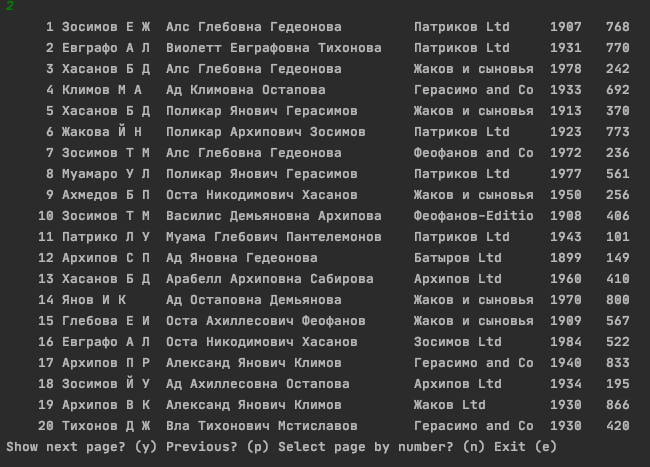
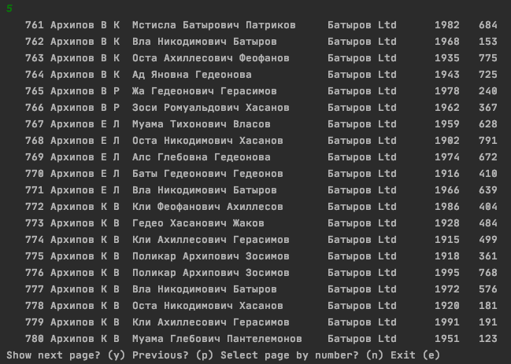
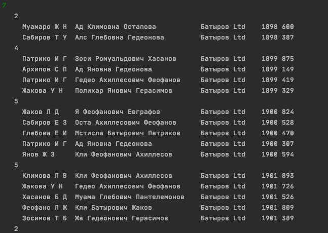

# О проекте
Это мой курсовой проект по дисциплине "Структуры и алгоритмы обработки данных".  
Программа написана на языке С++(std 14), представляет собой консольное приложение и состоит из 6 модулей: main, list, tree, encode, record, tools.  
Цель работы программы состоит в том чтобы считать базу данных, из бинарного файла в формате .dat, и обработать эту информацию
(вывод, сортировка, поиск, кодирование).  
При разработке особое внимание уделялось эффективности применяемых алгоритмов, продуктивному использованию динамической памяти, написанию чистого и легко читаемого кода.  
При работе с динамической памятью проводились проверки с помощью анализатора памяти Valgrind - что позволило исключить утечки памяти.  
Так же при разработке было уделено внимание обработке пользовательского ввода и построению интуитивно понятного интерфейса.  
Программа обрабатывает любой ввод, и выдает соответсвующие сообщения о статусе работы.
Код программы написан с приминенем основных принципов ООП.  
Интерфейс приложения представляет собой окно в котором выводится меню с возможными пунктами для выбора. Программа работает в режиме бесконечного цикла и заканчивает свою работу только по запросу пользователя.  
***Важно***  
База данных в бинарном файле записана в кодировке CP(IBM)-866, если вы используете Linux или Mac,  
для корректного вывода - поменяйте кодировку в терминале либо IDE
# Цель проекта
Хранящуюся  в  файле  базу  данных загрузить в оперативную память компьютера и  построить  индексный  массив, упорядочивающий данные по издательству и автоpу, используя метод **прямого слияния** в качестве метода  сортировки.  
Предусмотреть  возможность  поиска  по  ключу (три первые буквы издательства ) в упорядоченной  базе, в  результате  которого  из  записей с одинаковым  ключом  формируется очередь, содержимое  очереди  выводится  на экран.  
Из записей очереди построить **дерево оптимального поиска** (приближенный алгоритм А1) по году издания и  предусмотреть  возможность  поиска в дереве  по запросу.  
Закодировать файл базы данных статическим **кодом Фано**, предварительно оценив вероятности всех встречающихся в ней символов. Построенный код вывести  на  экран.  
# Сборка
Для сборки проекта написан CMakeList. Выполните следующие команды:  
$ git clone https://github.com/morozov312/SaodCourse   
$ cmake CMakeLists.txt && make  
# Пример работы

<i>Меню</i>

<i>Вывод базы данных</i>

<i>Очередь, построенная по результатам поиска</i>

<i>Вывод дерева оптимального поиска, обход слева на право</i>

